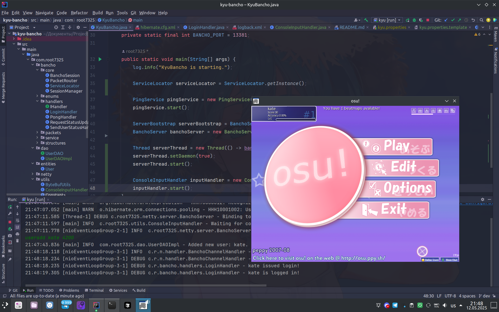

   
# KyuBancho - an osu!Bancho emulator
**KyuBancho** is an **experimental server emulator** for some circle-clicking game written on **Java**.

## ⚠️ Before all
This project is in **early development state**. Many core features aren't implement or incomplete. The code **may** contain bugs and **questionable** solutions!

## Implemented features
1. Netty implemented TCP server
2. Basic user session management
3. Ping/pong (so you don't get **Osu_Exit** just because)
4. MySQL Database with Hibernate
5. In-game authentication

## Planned features
1. Chat system
2. Own BanchoBot
3. Replay seeking

## Requirements
- Java 17 or higher
- Maven 3.6 or higher
- MySQL Server

## Usage
1. Setup MySQL Server
    - Use `src/main/resources/kyu.properties.template` as a reference
2. Patch osu! client
    - Server is tested **only** on build b497
    - Automated patching solution may appear at some day
3. Build and run the server
    - Either directly from your IDE
    - Or via `mvn package` and running with `java -jar target/kyu-bancho-0.0.4X.jar`
    Don't forget to `mvn compile` after changing properties.
4. Create an account when running with: `useradd {username} {password}`

## References
Some parts of this project are based on the following code:

- [ekgame/bancho-api](https://github.com/ekgame/bancho-api)
  - [ByteDataInputStream.java](https://github.com/ekgame/bancho-api/blob/master/src/main/java/lt/ekgame/bancho/api/packets/ByteDataInputStream.java) - Reference implementation for `ByteBufUtils`
  - [ByteDataOutputStream.java](https://github.com/ekgame/bancho-api/blob/master/src/main/java/lt/ekgame/bancho/api/packets/ByteDataOutputStream.java) - Reference implementation for `ByteBufUtils`

## License
This project is licensed under the [MIT License](LICENSE) - so do whatever you want with it, just don't blame me if something goes sideways.